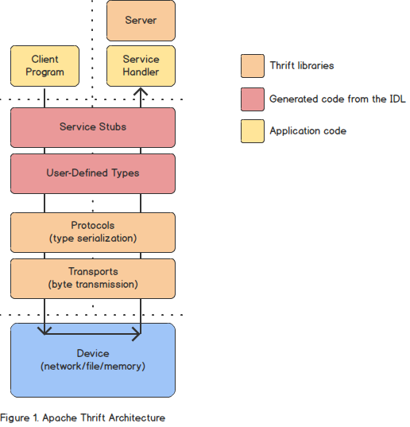
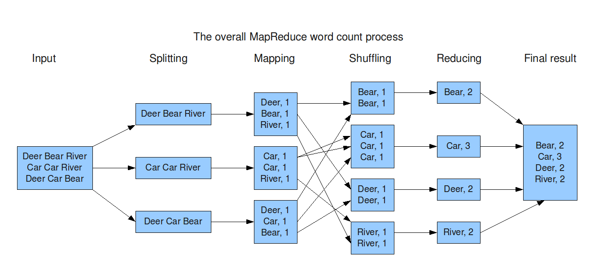
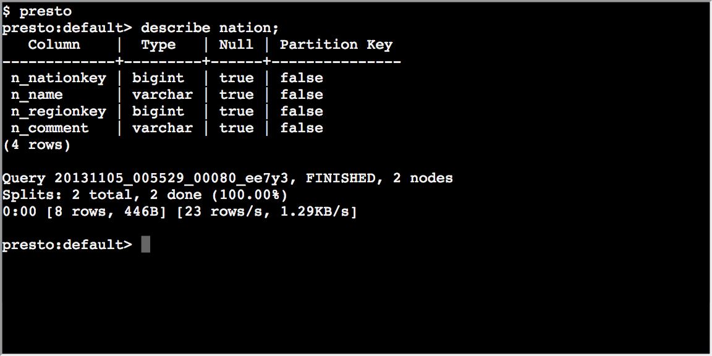
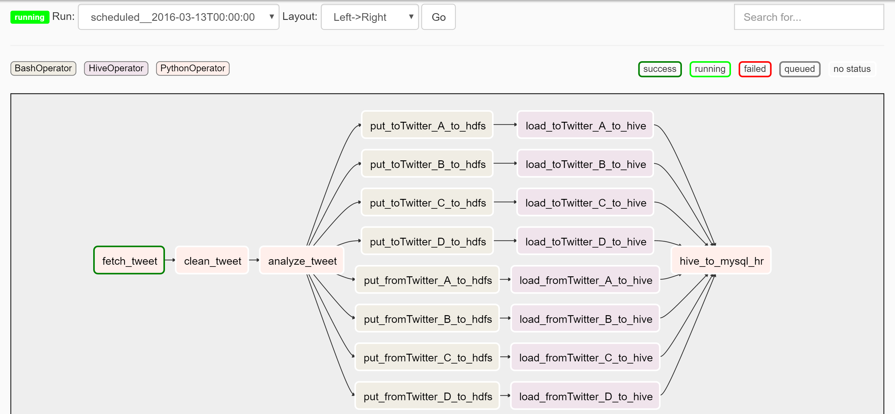
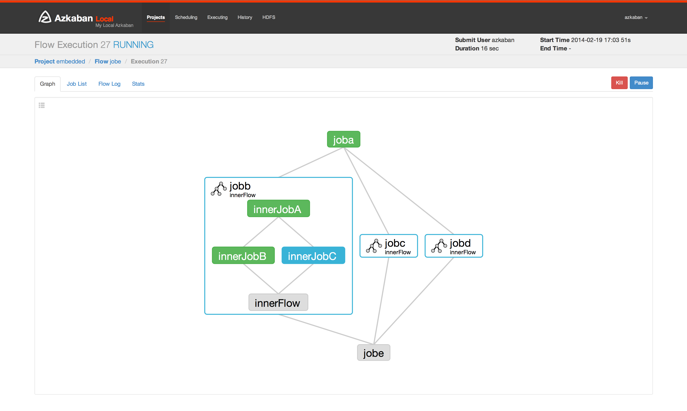
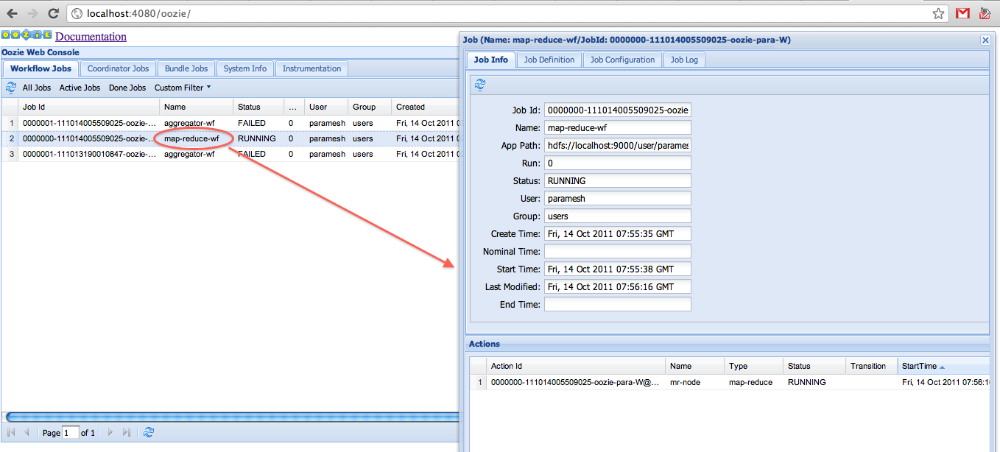
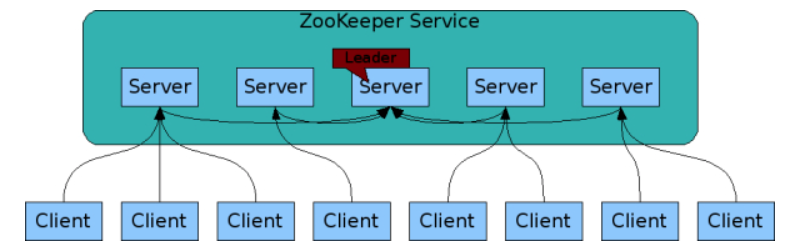
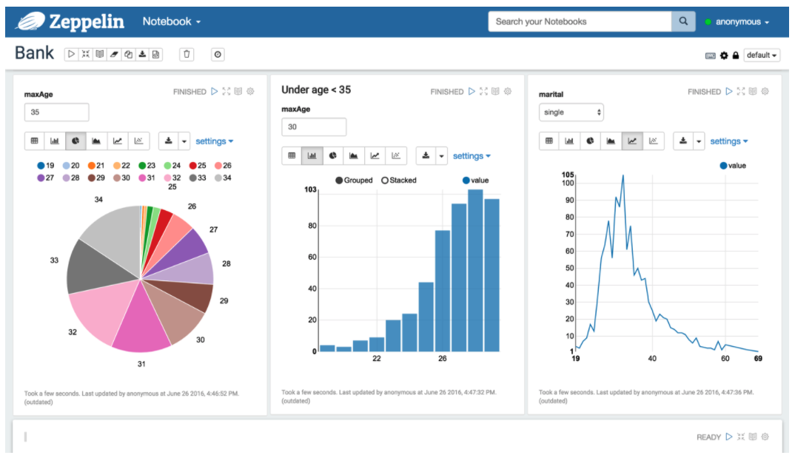
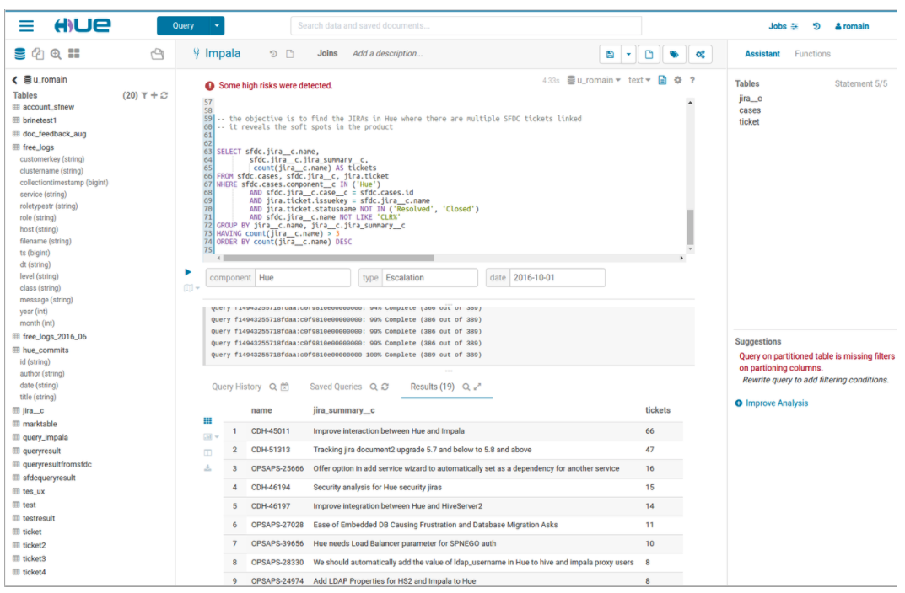

# 빅데이터 에코시스템

빅데이터는 수집, 정제, 적재, 분석, 시각화의 여러 단계를 거친다. 이 단계를 거치는 동안 여러가지 기술을 이용하여 처리되고, 이 기술들을 통틀어 빅데이터 에코 시스템이라고 한다.

## 1. 수집 기술

수집기술은 빅데이터 분석을 위한 데이터를 수집하는 기술이다. 데이터는 실시간 데이터 수집 기술, 배치 데이터 수집기술이 있다. 데이터의 종류에도 로그 데이터, DB 데이터, API 호출 데이터 등
여러가지 종류가 있다.

Flume, Kafka, Sqoop, Nifi, Flink, Splunk, Logstash, Fluentd 등 여러가지 기술이 있다.

## 2. 데이터 직렬화

빅데이터 에코 시스템이 다양한 기술과 언어로 구현되기 때문에 각 언어간에 내부 객체를 공유해야 하는 경우가 있다. 이를 효율적으로 처리하기 위해서 데이터 직렬화기술을 이용한다.

### Avro

에이브로(Avro)는 아파치의 하둡 프로젝트에서 개발된 원격 프로시저 호출(RPC) 및 데이터 직렬화 프레임워크이다. 자료형과 프로토콜 정의를 위해 JSON을 사용하며 Compact 바이너리 포맷으로
데이터를 직렬화한다.


### Thrift

Thrift는 페이스북에서 개발한 서로 다른 언어로 개발된 모듈의 통합을 지원하는 RPC 프레임워크이다. 데이터 타입과 서비스 인터페이스를 선언하면, RPC 형태의 클라이언트와 서버 코드를 자동으로
생성해 준다. 자바, C++, C#, Perl, PHP, 파이썬, 델파이, Erlang, Go, Node.js 등과 같이 다양한 언어를 지원한다.



### Protocol Buffers

프로토콜 버퍼(Protocol Buffers)는 구글에서 개발한 RPC 프레임워크이다. 구조화된 데이터를 직렬화하는 방식을 제공한다. C++,C#, Go, Java, Python, Object C,
Javascript, Ruby 등 다양한 언어를 지원하며 특히 직렬화 속도가 빠르고 직렬화된 파일의 크기도 작아서 많은 곳에서 사용된다.

```protobuf
// polyline.proto
syntax = "proto2";

message Point {
  required int32 x = 1;
  required int32 y = 2;
  optional string label = 3;
}
```

## 3. 저장

빅데이터는 대용량의 데이터를 저장하기 때문에 데이터 저장의 안정성과 속도가 중요하다. HDFS외에도 아마존 AWS의 S3, MS Azure의 Data Lake, Blob Storage, Google의
Cloud Storage가 있다.

### HDFS

하둡 분산 파일 시스템(HDFS, Hadoop distributed file system)은 하둡 프레임워크를 위해 자바 언어로 작성된 분산 확장 파일 시스템이다. HDFS는 범용 컴퓨터를 클러스터로
구성하여 대용량의 파일을 블록단위로 분할하여 여러서버에 복제하여 저장한다.

### HBase

HBase는 HDFS 기반의 칼럼 기반 NoSQL 데이터베이스이다. 구글의 빅테이블(BigTable) 논문을 기반으로 개발됐다.

## 4. 데이터 처리

데이터 처리는 빅데이터를 분석하는 기술이다. 하둡의 맵리듀스를 기반으로, 스파크, 하이브, HBase 등 여러가지 기술이 있다.

### MapReduce

맵리듀스는 HDFS상에서 동작하는 가장 기본적인 분석 기술이다. 간단한 단위작업을 반복할 때 효율적인 맵리듀스 모델을 이용하여 데이터를 분석한다.



### Spark

스파크(Spark)는 인메모리 기반의 범용 데이터 처리 플랫폼이다. 배치 처리, 머신러닝, SQL 질의 처리, 스트리밍 데이터 처리, 그래프 라이브러리 처리와 같은 다양한 작업을 수용할 수 있도록
만들어졌다.


### Presto

프레스토(Presto)는 페이스북이 개발한 대화형 질의를 처리하기 위한 분산 쿼리 엔진이다. 메모리 기반으로 데이터를 처리하며, 다양한 데이터 저장소에 저장된 데이터를 SQL로 처리할 수 있다. 특정
질의의 경우 하이브 대비 10배 정도 빠른 성능을 보여준다.



### Hive

하이브(Hive)는 하둡 기반의 데이터웨어하우징용 솔루션이다. 페이스북에서 개발했다. SQL과 매우 유사한 HiveQL이라는 쿼리 언어를 제공한다. 데이터 분석가들도 쉽게 하둡 데이터를 분석할 수 있게
도와준다. HiveQL은 내부적으로 맵리듀스 잡으로 변환되어 실행된다.

```hiveql
hive>
SELECT col1, col2
FROM t1 1 3
    1 3
    1 4
    2 5
```

## 5. 작업 관리 기술

작업 관리 기술은 빅데이터를 분석하는 여러가지 단계를 효율적으로 생성, 관리하고 모니터링 할 수 있게 도와주는 기술이다.

### Airflow

Airflow는 에어비앤비에서 개발한 데이터 흐름의 시각화, 스케쥴링, 모니터링이 가능한 워크플로우 플랫폼이다. Hive, Presto, DBMS 엔진과 결합하여 사용할 수 있다.



### Azkaban

Azkaban은 링크드인에서 개발한 워크플로우의 시각화, 스케쥴링, 인증 및 권한 관리, 모니터링, 알람 등 다양한 기능을 가지는 워크플로우 관리 도구이다.



### Oozie

Oozie는 하둡 작업을 관리하는 워크플로우 및 코디네이터 시스템이다.



## 6. 분산 서버 관리

클러스터에서 여러가지 기술이 이용될 때 하나의 서버에서 모든 작업이 진행되면 이 서버가 단일실패지점(SPOF)이 될 수 있다. 이로 인한 리스크를 줄이기 위해 분산 서버 관리 기술을 이용한다.

### Zookeepr

분산 환경에서 서버 간의 상호 조정이 필요한 다양한 서비스를 제공하는 시스템으로, 크게 다음과 같은 네 가지 역할을 수행한다.

1. 하나의 서버에만 서비스가 집중되지 않게 서비스를 알맞게 분산해 동시에 처리하게 한다.
2. 하나의 서버에서 처리한 결과를 다른 서버와도 동기화해서 데이터의 안정성을 보장한다.
3. 운영 서버에 문제가 발생해서 서비스를 제공할 수 없을 경우, 다른 대기 중인 서버를 운영 서버로 바꿔서 서비스가 중지 없이 제공되게 한다.
4. 분산 환경을 구성하는 서버의 환경설정을 통합적으로 관리한다.



## 7. 시각화

### Zeppelin

Zeppelin은 한국의 NFLab이라는 회사에서 개발한 오픈소스 솔루션이다. Notebook 이라고 하는 웹 기반 Workspace에 Spark, Hive, ElasticSearch 등 다양한
솔루션의 API, Query 등을 실행하고 결과를 웹에 나타내는 솔루션이다.



### Hue

하둡 휴(Hue, Hadoop User Experience)는 하둡과 하둡 에코시스템의 지원을 위한 웹 인터페이스를 제공하는 오픈소스이다. Hive 쿼리를 실행하는 인터페이스를 제공하고, 시각화를 위한
도구를 제공한다. Job의 스케줄링을 위한 인터페이스와 Job, HDFS, 등 하둡을 모니터링하기 위한 인터페이스도 제공한다.


