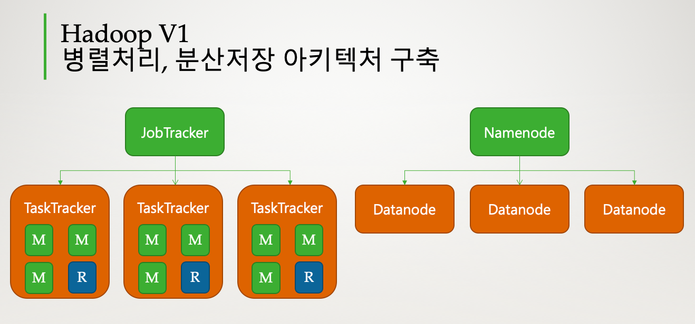
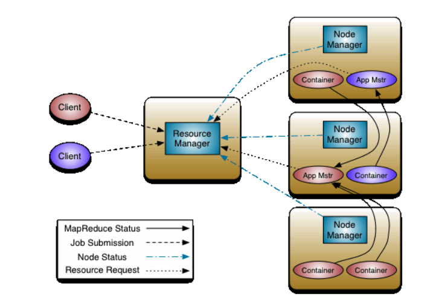
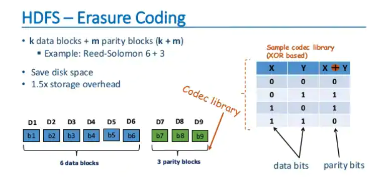

# 하둡이란?

하둡은 2006년 야후에서 검색엔진을 개발하는 과정에서 **대용량의 비정형 데이터를 기존의 RDB 기술로는 처리가 힘들다는 것을 깨닫고, 새로운 기술을 찾는 중 구글에서 발표한 GFS와
MapReduce 관련 논문을 참고하여 개발**했다. 이후 아파치 재단의 오픈 소스로 공개됐다.

**하둡은 하나의 성능 좋은 컴퓨터를 이용하여 데이터를 처리하는 대신, 적당한 성능의 범용 컴퓨터 여러 대를 클러스터화하고, 큰 크기의 데이터를 클러스터에서 병렬로 동시에 처리하여 처리 속도를 높이는
것을 목적으로 하는 분산처리를 위한 오픈소스 프레임워크이다.**

## 하둡의 구성 요소

하둡은 다음의 주요 모듈로 구성된다.

- Hadoop Common
    - 하둡의 다른 모듈을 지원하기 위한 공통 컴포넌트 모듈
- Hadoop HDFS
    - 분산저장을 처리하기 위한 모듈
    - 여러 개의 서버를 하나의 서버처럼 묶어서 데이터를 저장
- Hadoop YARN
    - 병렬처리를 위한 클러스터 자원관리 및 스케줄링 담당
- Hadoop MapReduce
    - 분산되어 저장된 데이터를 병렬 처리할 수 있게 해주는 분산 처리 모듈
- Hadoop Ozone
    - 하둡을 위한 오브젝트 저장소

## 하둡의 장단점

- 장점
    - 오픈소스
    - 시스템을 중단하지 않고, 장비 추가가 용이 (Scale Out)
    - 일부 장비에 장애가발생하더라도 전체 시스템 사용성에 영향이 적다.
    - 저렴한 구축 비용과 비용대비 빠른 데이터 처리
    - 오프라인 배치 프로세싱에 최적화
- 단점
    - HDFS에 저장된 데이터를 변경 불가
    - 실시간 데이터를 분석해 처리하는 작업에는 부적합
    - 너무 많은 버전과 부실한 서포트
    - 설정의 어려움

## 하둡 v1

2011년에 정식 발표된 하둡 v1은 분산저장, 병렬처리 프레임워크를 정의했다. **`분산저장`은 `네임노드`와 `데이터노드`가 처리한다.**

- **네임노드**: 블록정보를 가지고 있는 데타데이터를 관리하고, 데이터 노드를 관리한다.
- **데이터노드**: 데이터를 블록단위로 나누어 저장한다. 블록단위 데이터는 복제하여 데이터 유실에 대비한다.

**`병렬처리`는 `잡트래커`와 `태스크트래커`가 처리한다.**

- **잡트래커**: 전체 작업의 진행상황을 관리하고, 자원 관리도 처리한다. 최대 4000대의 노드를 등록할 수 있다.
- **태스크트래커**: 실제 작업을 처리한다. 병렬처리의 작업 단위는 슬롯(slot)이다.

> 맵 슬롯, 리듀스 슬롯의 개수가 정해져있고, 실행 시점에 역할이 정해지면 슬롯의 용도를 변경할 수 없기 때문에 맵 작업이 진행중에는 리듀스 슬롯은 대기상태로 있었다. 이로 인해 클러스터가 100% 활용되지 않는 문제가 있다.

### 하둡 v1 특징

- 분산저장, 병렬처리 프레임워크를 정의
    - 분산저장 (HDFS)
        - 네임노드, 데이터노드가 처리
    - 병렬처리 (MapReduce)
        - 잡트래커, 태스크트래커가 처리
- 클러스터당 최대 4000개의 노드를 등록
- 작업 처리를 슬롯 단위로 처리
    - 맵, 리듀스 슬롯을 구분하여 처리

## 하둡 v2

2012년에 정식 발표된 하둡 v2는 잡트래커의 병목현상을 제거하기 위해 YARN 아키텍처를 도입했다. YARN 아키텍처는 잡트래커의 기능을 분리하여 자원관리는 리소스 매니저와 노드매니저가 담당하고,
애플리케이션의 라이프 사이클관리는 애플리케이션 마스터가 담당하고, 작업의 처리는 컨테이너가 담당한다. **자원관리와 애플리케이션 관리의 분리를 통해 클러스터당 최대 만개의 노드를 등록할 수 있다.**

YARN 아키텍처의 작업의 처리 단위는 컨테이너이다. 작업이 제출되면 애플리케이션 마스터가 생성되고, 애플리케이션 마스터가 리소스 매니저에 자원을 요청하여 실제 작업을 담당하는 컨테이너를 할당받아
작업을 처리한다. 컨테이너는 작업이 요청되면 생성되고, 작업이 완료되면 종료되기 때문에 클러스터를 효율적으로 사용할 수 있다.

**또한 YARN 아키텍처에서는 MR로 구현된 작업이 아니어도 컨테이너를 할당 받아서 동작할 수 있기 때문에 Spark, HBase, Storm등 다양한 컴포넌트들을 실행할 수 있다.**

### 하둡 v2 특징

- YARN을 도입하여 병렬 처리 구조를 변경
    - 클러스터 관리
        - 리소스 매니저, 노드 매니저
    - 작업 관리
        - 애플리케이션 마스터, 컨테이너
- MR 외 Spark, Hive, Pig 등 다른 분산 처리 모델도 수행 가능
- 클러스터당 1만개 이상의 노드 등록 가능
- 작업 처리를 컨테이너 단위로 처리

## 하둡 v3

2017년 정식 발표된 하둡 v3는 이레이져 코딩(저장소의 효율성 증가), YARN 타임라인 서비스 v2 등이 도입됐다.

### 하둡 v3 특징

- 이레이져 코딩 도입
    - 기존의 블록 복제(Replication)를 대체하는 방식으로 HDFS 사용량 감소
- YARN 타입라인 서비스 v2 도입
    - 기존 타임라인 서비스보다 많은 정보를 확인 가능
- JAVA8 지원
- Ozone 추가
