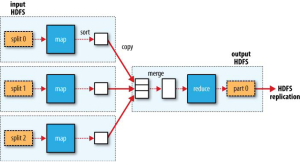
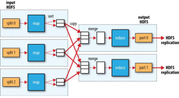
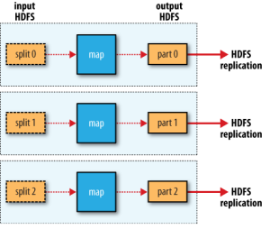

# 맵리듀스

맵리듀스는 간단한 단위작업을 반복하여 처리할 때 사용하는 프로그래밍 모델이다. 간단한 작업을 처리하는 맵(Map) 작업과 맵 작업의 결과물을 모아서 집계하는 리듀스(Reduce) 단계로 구성된다.

하둡에서 분산처리를 담당하는 맵리듀스 작업은 맵과 리듀스로 나누어져 처리된다. 맵, 리듀스작업은 병렬로 처리가 가능한 작업으로, 여러 컴퓨터에서 동시에 작업을 처리하여 속도를 높일 수 있다.

## 맵리듀스 작업 단위

하둡 v1의 작업 단위는 잡(job)이고, 하둡 v2의 작업 단위는 애플리케이션(application)이다. YARN 아키텍처가 도입되면서 이름은 변경됐지만 동일하게 관리된다. 잡은 맵 태스크와 리듀스
태스크로 나누어진다. 태스크는 어템프트(attempt) 단위로 실행된다.

하둡 잡이 생성되면 아이디가 job_xxx_xxx로 생성된다. 이 아이디로 잡의 상태, 로그를 확인할 수 있다. YARN에서는 application_xxx_xxx로 확인할 수 있다. 접두어는 다르지만
같은 작업이다.

잡에서 생성되는 맵태스크와 리듀스태스크는 아이디가 attempt_xxx_xxx_m_000000_0으로 생성된다. 맵 태스크는 중간아이디가 m으로 생성되고, 리듀스태스크는 r로 생성된다.

```
잡아이디: job_1520227878653_30484
애플리케이션 아이디: application_1520227878653_30484
어템프트 아이디: attempt_1520227878653_30484_m_000000_0
```

## 맵리듀스 장애극복(Failover)

맵리듀스는 실행 중 오류가 발생하면 설정된 횟수만큼 자동으로 반복된다. 반복후에도 오류가 발생하면 작업을 종료한다.

## 맵 입력 분할

맵의 입력은 스플릿(InputSplit)단위로 분할된다. 맵작업은 큰 데이터를 하나의 노드에서 처리하지 않고, 분할하여 동시에 병렬 처리하여 작업 시간을 단축한다.

스플릿이 작으면 작업 부하가 분산되어 성능을 높일 수 있다. 하지만 스플릿의 크기가 너무 작으면 맵의 개수가 증가하고 맵 작업 생성을 위한 오버헤드가 증가하여 작업이 느려질 수 있다. 일반적으로 맵
작업의 적절한 스플릿 크기는 데이터 지역성의 이점을 얻을 수 있는 HDFS 블록의 기본 크기(128MB)이다.

## 맵 작업 데이터 지역성

맵 작업은 HDFS에 입력 데이터가 있는 노드에서 실행할 때 가장 빠르게 동작한다. 클러스터의 네트워크 대역을 사용하지 않고 처리할 수 있기 때문이다. 데이터가 있는 노드에서 작업을 처리할 수 없다면
동일한 랙의 노드, 다른 랙의 노드 순서로 맵 작업이 실행가능한 노드를 찾는다.

맵 작업의 적절한 스플릿 크기가 HDFS 블록의 기본크기인 이유는 단일 노드에 해당 블록이 모두 저장된다고 확신할 수 있는 입력 크기이기 때문이다. 스플릿 크기가 블록의 기본 크기일때 맵 작업이 로컬
디스크의 데이터만 이용하여, 다른 노드에서 데이터를 전송받아 처리할 때 보다 빠르게 작업을 처리할 수 있다.

맵 작업의 결과는 로컬 디스크에 임시 저장된다. 맵 작업의 결과는 리듀스 작업의 입력으로 쓰이는 임시 결과물이기 때문이다. 리듀스 작업은 맵 작업의 결과를 입력으로 받기 때문에 지역성의 장점이 없다.
리듀스 작업의 결과는 HDFS에 저장된다.

## 맵리듀스 작업의 종류

맵리듀스는 리듀서 작업이 있는 경우와 없는 경우가 있다. 파일을 읽어서 바로 쓰는 작업의 경우 리듀서가 필요 없어서 매퍼만 있는 작업(Mapper Only)이 된다. 집계를 진행해야 해서 리듀서가
필요한 경우 정렬이 필요한 경우는 리듀서가 하나만 생성된다. 나머지의 경우 리듀서가 여러개로 생성된다. 각 작업의 최종 매퍼, 리듀서의 수만큼 파일이 생성된다.

### 리듀서가 하나인 경우

모든 데이터의 정렬작업 같은 경우이다. 리듀서 하나로 모든 작업을 처리하기 때문에 시간이 오래걸린다.



### 리듀서가 여러개인 경우

일반적인 집계 작업의 경우 리듀서가 여러개 생성된다. 리듀서의 수만큼 파일이 생성된다. HDFS의 부하를 방지하기 위해서 추가적인 파일 머지 작업이 필요할 수 있다.



### 리듀서가 없는 경우(Mapper Only 작업)

원천 데이터를 읽어서 가공을하고 바로 쓰는 경우이다. 리듀서 작업이 없기 때문에 빠릅니다. 매퍼의 수만큼 파일이 생성되기 때문에 추가적인 파일 머지 작업이 필요할 수 있다.


