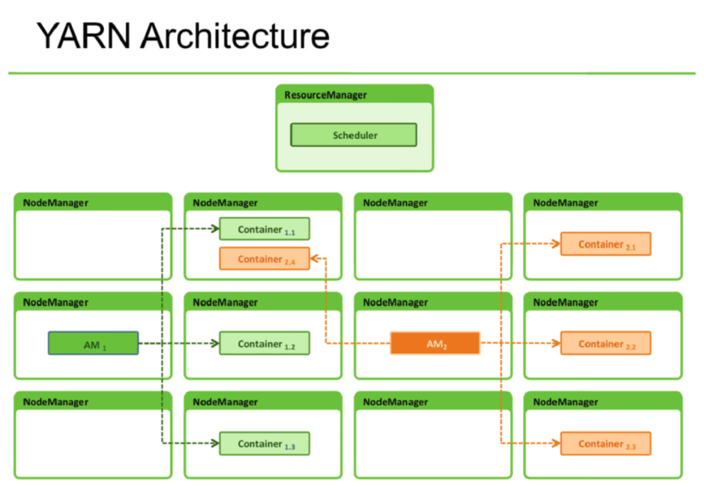
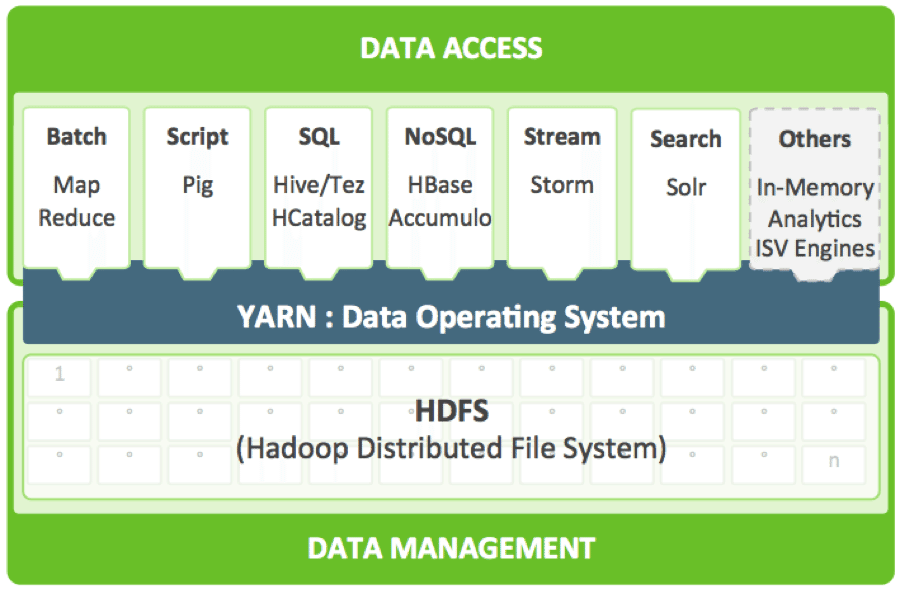

# YARN

YARN(Yet Another Resource Negotiator)은 하둡2에서 도입한 클러스터 리소스 관리 및 애플리케이션 라이프 사이클 관리를 위한 아키텍처이다.

## 등장 배경

잡트래커 한대가 클러스터의 모든 노드를 관리해야 하고, 모든 애플리케이션을 관리 하였기 때문에 잡트래커에 많은 메모리를 할당 해야 했고, 최대 4000대의 노드까지 관리 할 수 있었다.

잡트래커는 슬롯 단위로 리소스를 관리하여 시스템의 전체 자원을 효율적으로 사용할 수 없었다. 슬롯 단위 리소스 관리는 클러스터의 메모리, CPU 자원을 분할하여 슬롯단위로 구분한다. 100GB의
메모리를 가지는 클러스터를 1G로 구분하여 100개의 슬롯을 만들고, 60개의 맵 슬롯, 40개의 리듀서 슬롯으로 구분한다. 슬롯은 각각의 역활에 맞게 동작할 수 있다. 따라서 맵 슬롯이 동작하는 동안
리듀서 슬롯은 대기하게 된다. 맵 슬롯에 더 많은 일을 하게 되더라도 리듀서 슬롯은 대기하게 된다.

또한 잡 트래커의 애플리케이션은 맵리듀스 작업만 처리할 수 있어서 유연성이 부족하였다. 맵리듀스 API를 구현한 작업만 처리할 수 있었기 때문에 SQL 기반 작업의 처리나, 인메모리 기반의 작업의
처리에 어려움이 있었다.

이런 단점을 극복하기 위하여 YARN 아키텍처가 도입되었다.

## YARN 구성

YARN은 잡트래커의 기능을 분리하여 자원 관리는 리소스매니저와 노드매니저, 애플리케이션 라이프 사이클 관리 기능은 애플리케이션 마스터와 컨테이너가 담당하도록 하였다.

## 자원관리

클러스터 자원 관리는 리소스매니저(ResourceManager)와 노드매니저(NodeManager)를 이용하여 처리한다.

- 노드매니저
    - 클러스터의 각 노드마다 실행된다.
    - 현재 노드의 자원 상태를 관리하고, 리소스매니저에 현재 자원 상태를 보고한다.
- 리소스매니저
    - 노드매니저로부터 전달받은 정보를 이용하여 클러스터 전체의 자원을 관리한다.
    - 자원 사용 상태를 모니터링하고, 애플리케이션 마스터에서 자 자원을 요청하면 비어 있는 자원을 사용할 수 있도록 처리한다.
- 스케줄러
    - 자원을 분배하는 규칙을 설정한다.
    - 스케줄러에 설정된 규칙에 따라 자원을 효율적으로 분배합니다.

## 다양한 애플리케이션

YARN에서는 맵리듀스 API로 구현된 프로그램외에도 다양한 애플리케이션을 실행 할 수 있다. 맵리듀스, 피그, 스톰, 스파크 등 하둡 에코시스템의 다양한 데이터 처리 기술을 이용할 수 있다.

## 최대 1만개의 노드 관리

기능 분리를 통하여 1만대 이상의 클러스터로 확장 할 수 있도록 확장성을 제공하였다.
