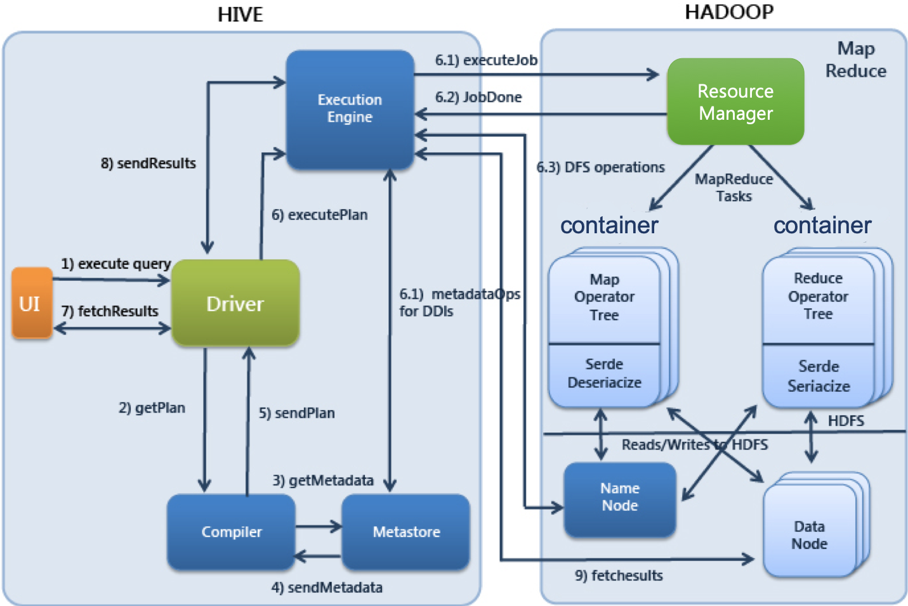
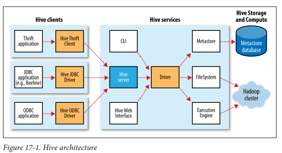

# 하이브란?

하이브는 하둡 에코시스템 중에서 데이터를 모델링하고 프로세싱하는 경우 가장 많이 사용하는 **데이터 웨어하우징용 솔루션**이다. (SQL을 하둡에서 사용하기 위한 프로젝트로 시작됐다. 페이스북에서
자사의 데이터 분석을 위해 개발하여 아파치 오픈소스 프로젝트로 넘어왔다.)

RDB의 데이터베이스, 테이블과 같은 형태로 HDFS에 저장된 데이터의 구조를 정의하는 방법을 제공하며, 이 데이터를 대상으로 SQL과 유사한 HiveQL 쿼리를 이용하여 데이터를 조회하는 방법을
제공한다.

## 특징

- SQL을 이용한 맵리듀스 처리
- 파일 데이터의 논리적 표현
- 빅데이터의 배치 처리를 목표

## 하이브 구성요소

- UI
    - 사용자가 쿼리 및 기타 작업을 시스템에 제출하는 사용자 인터페이스
    - CLI, JDBC 등
- Driver
    - 쿼리를 입력받고 작업을 처리
    - 사용자 세션을 구현하고, JDBC/ODBC 인터페이스 API 제공
- Compiler
    - 메타 스토어를 참고하여 쿼리 구문을 분석하고 실행계획을 생성
- Metastore
    - 디비, 테이블, 파티션의 정보를 저장
- Execution Engine
    - 컴파일러에 의해 생성된 실행 계획을 실행

## 하이브 서비스

## 하이브 실행 순서

1. 사용자가 제출한 SQL문을 드라이버가 컴파일러에 요청하여 메타스토어의 정보를 이용해 처리에 적합한 형태로 컴파일
2. 컴파일된 SQL을 실행엔진으로 실행
3. 리소스 매니저가 클러스터의 자원을 적절히 활용하여 실행
4. 실행 중 사용하는 원천데이터는 HDFS등의 저장장치를 이용
5. 실행결과를 사용자에게 반환

