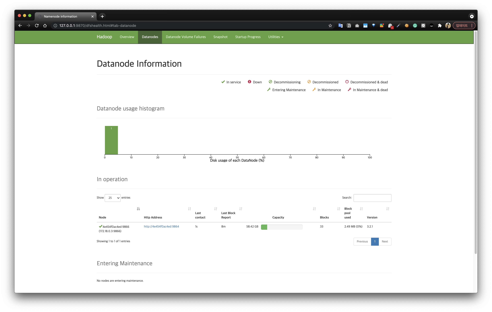

# Overview

`HDFS`, `YARN`, `Hive`를 docker로 띄워 사용해보자.

```bash
> git clone git@github.com:kadensungbincho/de-hands-on.git
> cd de-hands-on/docker-hadoop-poc
> docker-compose up -d

...
...
Creating historyserver                 ... done
Creating hive-metastore-mysql          ... done
Creating datanode                      ... done
Creating docker-hadoop-poc_zookeeper_1 ... done
Creating nodemanager                   ... done
Creating resourcemanager               ... done
Creating namenode                      ... done
Creating hive-metastore                ... done
Creating hive-server                   ... done
```

docker-compose up을 실행하면, 다음과 같이 컨테이너가 생성된다.


```bash
> docker ps

CONTAINER ID   IMAGE                                                           COMMAND                  CREATED              STATUS                        PORTS                                                                                  NAMES
72cff557ffa3   kadensungbincho/hadoop-hive-mysql:hive3.1.2-hadoop3.2.1-java8   "entrypoint.sh /bin/…"   About a minute ago   Up About a minute             0.0.0.0:10000->10000/tcp, :::10000->10000/tcp, 10002/tcp                               hive-server
3ec53b4ef532   kadensungbincho/hadoop-hive-mysql:hive3.1.2-hadoop3.2.1-java8   "entrypoint.sh start…"   About a minute ago   Up About a minute             10000/tcp, 0.0.0.0:9083->9083/tcp, :::9083->9083/tcp, 10002/tcp                        hive-metastore
694fdfc292e2   zookeeper:3.4.14                                                "/docker-entrypoint.…"   About a minute ago   Up About a minute             2888/tcp, 0.0.0.0:2181->2181/tcp, :::2181->2181/tcp, 3888/tcp                          docker-hadoop-poc_zookeeper_1
8b63d507f658   bde2020/hadoop-resourcemanager:2.0.0-hadoop3.2.1-java8          "/entrypoint.sh /run…"   About a minute ago   Up About a minute (healthy)   0.0.0.0:8032->8032/tcp, :::8032->8032/tcp, 0.0.0.0:8088->8088/tcp, :::8088->8088/tcp   resourcemanager
f354ff94af8e   bde2020/hadoop-nodemanager:2.0.0-hadoop3.2.1-java8              "/entrypoint.sh /run…"   About a minute ago   Up About a minute (healthy)   0.0.0.0:8042->8042/tcp, :::8042->8042/tcp                                              nodemanager
602a05c87f47   bde2020/hadoop-historyserver:2.0.0-hadoop3.2.1-java8            "/entrypoint.sh /run…"   About a minute ago   Up About a minute (healthy)   0.0.0.0:8188->8188/tcp, :::8188->8188/tcp                                              historyserver
1c553fd72ba3   bde2020/hadoop-namenode:2.0.0-hadoop3.2.1-java8                 "/entrypoint.sh /run…"   About a minute ago   Up About a minute (healthy)   0.0.0.0:8020->8020/tcp, :::8020->8020/tcp, 0.0.0.0:9870->9870/tcp, :::9870->9870/tcp   namenode
48874f58afb3   mysql:8.0.21                                                    "docker-entrypoint.s…"   About a minute ago   Up About a minute             0.0.0.0:3306->3306/tcp, :::3306->3306/tcp, 33060/tcp                                   hive-metastore-mysql
4e454f0ac4ed   bde2020/hadoop-datanode:2.0.0-hadoop3.2.1-java8                 "/entrypoint.sh /run…"   About a minute ago   Up About a minute (healthy)   0.0.0.0:9864->9864/tcp, :::9864->9864/tcp                                              datanode
```

# HDFS

HDFS는 네임노드와 데이터노드로 구성되어 하나의 파일을 여러 블록으로 쪼개고 블록들을 여러 노드에 나누어 저장하고 관리한다.


## UI 확인

[http://localhost:9870/](http://localhost:9870/) 에 접속한다.


Overview 페이지에서는 하둡 버전, 설정된 파일 시스템의 용량(Capacity)와 같은 여러가지 정보를 확인할 수 있다.



Datanodes 페이지에서는 active한 데이터노드들의 상태를 확인할 수 있다.
[http://localhost:9864/](http://localhost:9864) 에 접근하면 데이터노드의 UI에 접근할 수 있다.


## HDFS 커맨트 실행해보기

간단한 커맨트들을 이용해 사용해보자.

```shell
> docker exec -it namenode bash

> jps
# 결과
436 NameNode
805 Jps
```

실행중인 프로세스를 확인할 수 있다.

```shell
> hdfs dfs -ls /
# 결과
Found 4 items
drwxrwxrwt   - root root                0 2021-10-20 15:06 /app-logs
drwxr-xr-x   - root supergroup          0 2021-10-20 15:06 /rmstate
drwxrwxr-x   - root supergroup          0 2021-10-20 15:06 /tmp
drwxr-xr-x   - root supergroup          0 2021-10-20 15:06 /user
```

`hdfs dfs -ls /`를 통해 root path의 파일 및 디렉토리를 출력한다.

```shell
> touch tmp.txt
> hdfs dfs -put tmp.txt /tmp
> hdfs dfs -ls /tmp
# 결과
Found 3 items
drwx------   - root supergroup          0 2021-10-20 15:06 /tmp/hadoop-yarn
drwx-wx-wx   - root supergroup          0 2021-10-20 15:08 /tmp/hive
-rw-r--r--   3 root supergroup          0 2021-10-20 15:23 /tmp/tmp.txt
```

`hdfs dfs -put <파일명> <destination path>`을 통해 로컬 파일 시스템의 파일을 HDFS의 분산파일시스템에 업로드할 수 있다.

```shell
> rm tmp.txt
> hdfs dfs -get /tmp/tmp.txt
> ls
# 결과
... ... ... tmp.txt
```

`hdfs dfs -get <파일명>`을 통해 로컬 파일 시스템을 제거해도 HDFS에 저장된 데이터를 로컬로 가져올 수 있다.

HDFS에 저장된 데이터는 데이터노드가 위치한 노드의 로컬 파일시스템의 특정 path에 저장된다. 그 파일을 확인하기 위해서는 다음과 같이 데이터노드의 설정(Configuring hdfs 부분)을
확인해야한다.

```shell
> docker logs datanode | less +F
# 결과
...
Configuring hdfs
 - Setting dfs.datanode.data.dir=file:///hadoop/dfs/data
...
```

실행 시 쉘 스크립트는 위와 같은 환경변수를 읽어서 `hdfs-site.xml`에 넣어주고 있다. `hdfs-site.xml`은 다음과 같이 확인가능하다.

```shell
> docker exec -it datanode bash
> cat /opt/hadoop-3.2.1/etc/hadoop/hdfs-site.xml
# 결과
...
<property><name>dfs.datanode.data.dir</name><value>file:///hadoop/dfs/data</value></property>
...
```

위와 같이 설정된 경우 HDFS에 파일을 쓰고, 데이터노드 안에서 `/hadoop/dfs/data`라는 위치를 확인해보면 HDFS에 저장하는 것들이 존재하는 것을 확인할 수 있다.

# YARN

YARN(Yet Another Resource Negotiator)은 하둡2에서 도입한 클러스터 리소스 관리 및 애플리케이션 라이프 사이클 관리를 위한 도구(아키텍처)이다.


## UI 확인

[http://localhost:8088/cluster](http://localhost:8088/cluster) 에 접속한다.


클러스터의 노드, 애플리케이션, 스케쥴러 등 리소스매니저에 대한 전반적인 정보를 제공한다.

# Hive & MapReduece

Hive를 통해 MapReduce 애플리케이션을 실행하고, YARN의 UI에서 확인해보자.

```shell
> docker exec -it hive-server bash
> hive
hive> show databases;
# 결과
OK
default
tmp
Time taken: 0.601 seconds, Fetched: 2 row(s)
```

tmp 데이터베이스에서 table을 조회할 수 있다.

```shell
hive> use tmp;
hive> show tables;
# 결과
OK
daily_employee
hourly_employee
Time taken: 0.044 seconds, Fetched: 2 row(s)

hive> select * from daily_employee;
# 결과
OK
3       Sungbin 10000   Sinsa   20191010
4       Bob     20000   NewYork 20191010
1       Kaden   10000   Seoul   20191011
2       Barney  20000   Berlin  20191011
Time taken: 1.703 seconds, Fetched: 4 row(s)
```

tmp.daily_employee 라는 테이블에는 4개의 행이 존재하고 있으며, 다음과 같이 sum을 하는 쿼리를 실행하고 YARN UI에서 해당 애플리케이션(잡)에 대한 정보를 확인할 수 있다.

```shell
hive> SELECT SUM(salary) FROM daily_employee;
# 결과
Query ID = root_20211020155523_7cda5f3d-2198-4e87-9cf4-d1f08176c6d4
Total jobs = 1
Launching Job 1 out of 1
Number of reduce tasks determined at compile time: 1
In order to change the average load for a reducer (in bytes):
  set hive.exec.reducers.bytes.per.reducer=<number>
In order to limit the maximum number of reducers:
  set hive.exec.reducers.max=<number>
In order to set a constant number of reducers:
  set mapreduce.job.reduces=<number>
Starting Job = job_1634745076897_0005, Tracking URL = http://resourcemanager:8088/proxy/application_1634745076897_0005/
Kill Command = /opt/hadoop-3.2.1/bin/mapred job  -kill job_1634745076897_0005
Hadoop job information for Stage-1: number of mappers: 1; number of reducers: 1
2021-10-20 15:55:31,635 Stage-1 map = 0%,  reduce = 0%
2021-10-20 15:55:36,797 Stage-1 map = 100%,  reduce = 0%, Cumulative CPU 1.37 sec
2021-10-20 15:55:41,918 Stage-1 map = 100%,  reduce = 100%, Cumulative CPU 2.98 sec
MapReduce Total cumulative CPU time: 2 seconds 980 msec
Ended Job = job_1634745076897_0005
MapReduce Jobs Launched:
Stage-Stage-1: Map: 1  Reduce: 1   Cumulative CPU: 2.98 sec   HDFS Read: 9627 HDFS Write: 107 SUCCESS
Total MapReduce CPU Time Spent: 2 seconds 980 msec
OK
60000.0
Time taken: 19.038 seconds, Fetched: 1 row(s)
```


