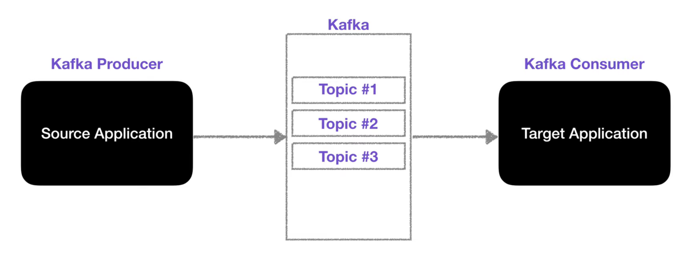
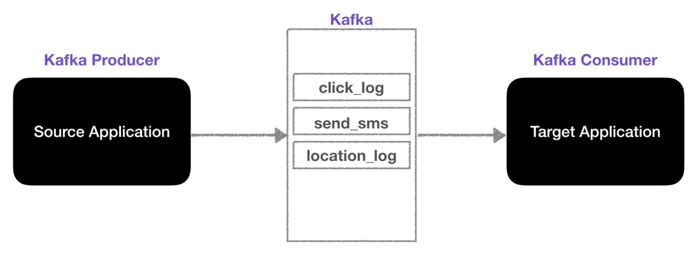
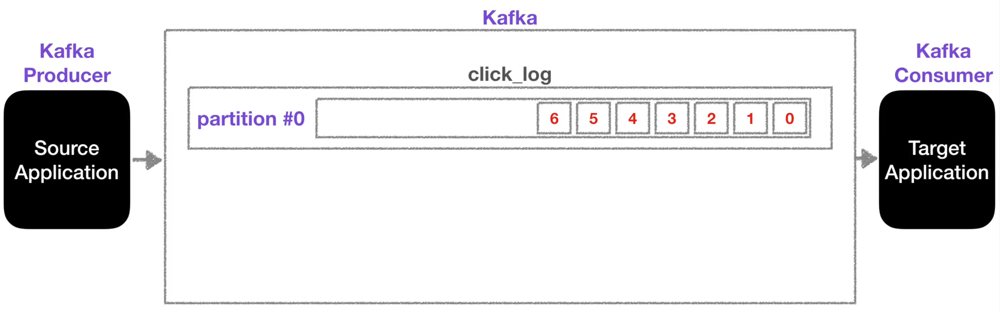
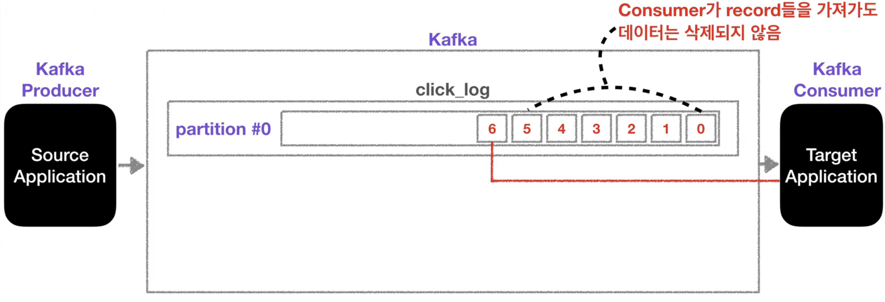
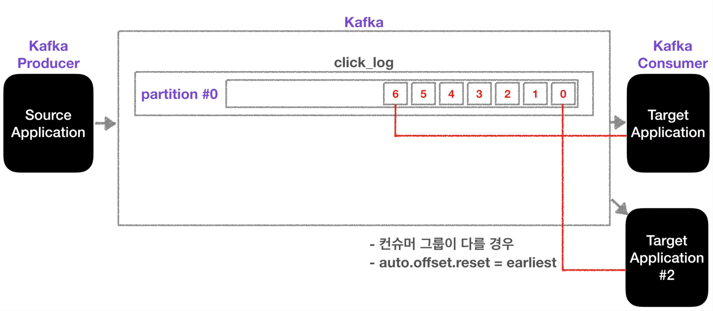
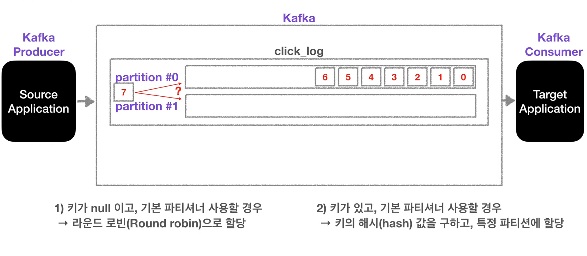
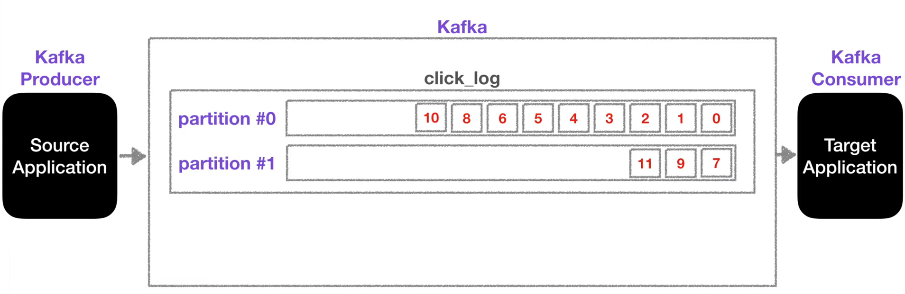

# apache Kafka 

## 토픽에 대하여

*프로듀서, 컨슈머 그리고 토픽*

카프카는 프로듀서에서 카프카 브로커의 토픽(메시지 큐)에 데이터를 넣는다. 컨슈머는 이를 가져간다. 프로듀서와 컨슈머는 라이브러리로 되어 있어 애플리케이션에서 구현 가능하다. 

*이름이 지정된 여러 토픽들*

카프카에서는 토픽을 여러개 생성할 수 있다. 데이터베이스의 테이블이나 파일 시스템의 폴더와 비슷한 성질을 가지고 있다. 또한 토픽은 위와 같이 이름을 가질 수 있다. 

### 내부 동작

*프로듀서 데이터 토픽 적재 및 컨슈머 폴링*

하나의 토픽은 여러개의 토픽으로 구성된다. 첫 파티션은 0부터 시작된다. 프로듀서가 데이터를 넣게되면 위와 같이 데이터가 차곡 차곡 쌓이게 된다. 컨슈머는 오래된 순서대로 데이터를 가져가게 된다. 더 이상 데이터가 들어오지 않으면 컨슈머는 또 다른 데이터가 들어올때까지 기다린다.

*컨슈머가 마지막 데이터를 읽은 상황*

컨슈머가 토픽의 모든 데이터를 조회하더라도 해당 데이터는 사라지지 않는다.

*같은 데이터를 조회하는 새로운 컨슈머*

- 컨슈머 그룹이 다름
- `auto.offset.reset = earliest`로 설정

인 경우 새로운 컨슈머가 붙었을 때 동일 데이터에 대해 여러 컨슈머가 처리 할 수 있다.

`auto.offset.reset = earliest` 가 설정된 경우 새로운 컨슈머가 붙었을 때 

*파티션이 두개 이상인 경우*

프로듀서가 새로운 데이터 7을 넣으려고하는 경우 1), 2)의 경우에 따라 다르게 넣어진다.

*키가 널이고 기본 파티션인경우 라운드로빈으로 데이터가 들어감*

#### 파티션 수

파티션을 늘리면 컨슈머의 개수를 늘려서 데이터 처리를 분산시킬 수 있다. 이에 대해서는 고승범님의 컨슈머 그룹 관련 [포스팅](https://www.popit.kr/kafka-consumer-group/)에서 확인 할 수 있다.

> ⚠️ 파티션 수를 무한정 늘리면 좋은거 아닌가요?
>
> 파티션을 늘리는건 가능하지만 파티션을 줄이는 것은 불가능하다.

#### 데이터가 삭제되는 타이밍

다음의 옵션에 따라 데이터가 삭제된다.

- `log.retention.ms` 

  ​	최대 record 보존 시간

- `log.retention.byte` 

  - 최대 record 보존 크기(byte)

## 출처

- [데브원영 유튜브](https://www.youtube.com/watch?v=waw0XXNX-uQ&list=PL3Re5Ri5rZmkY46j6WcJXQYRlDRZSUQ1j) 

