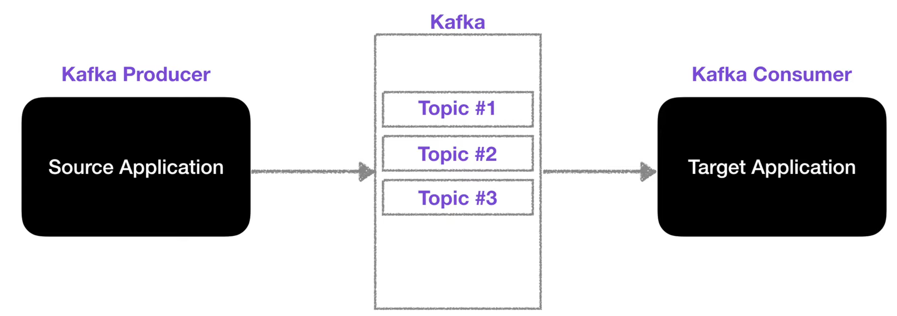
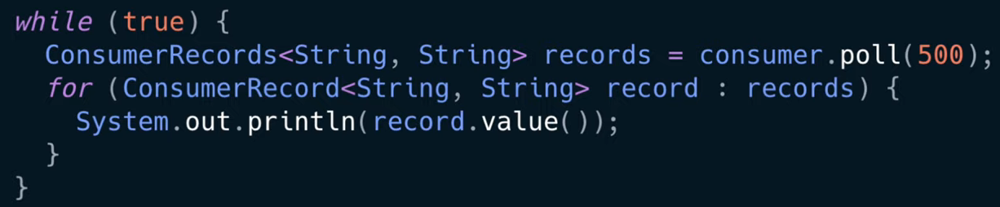
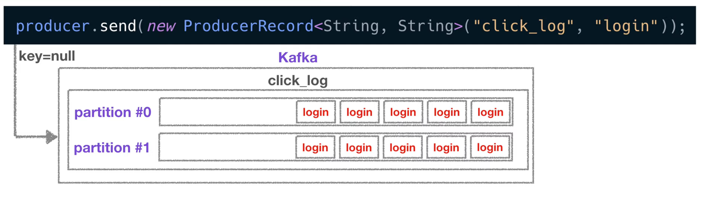
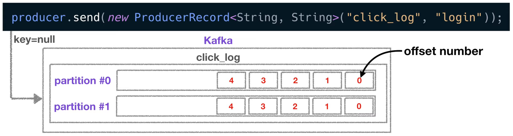
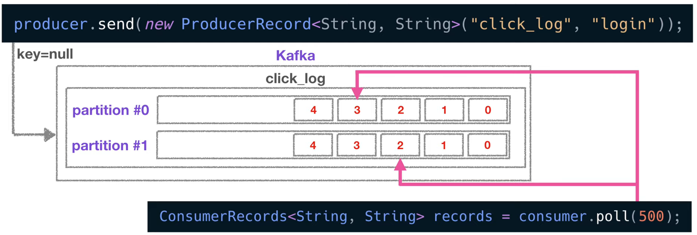
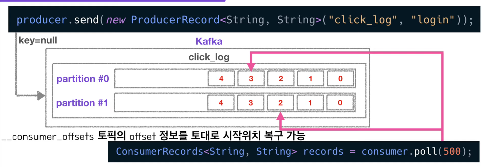
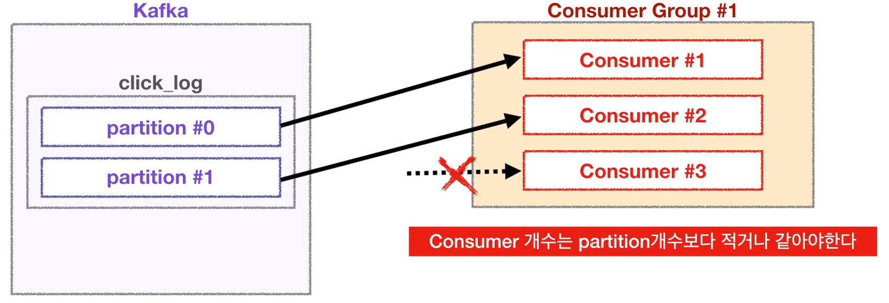
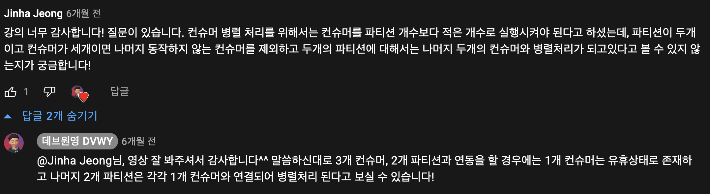
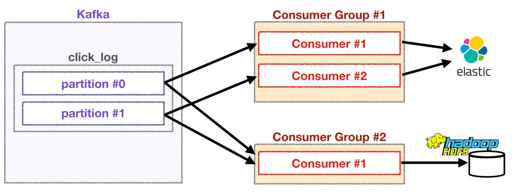
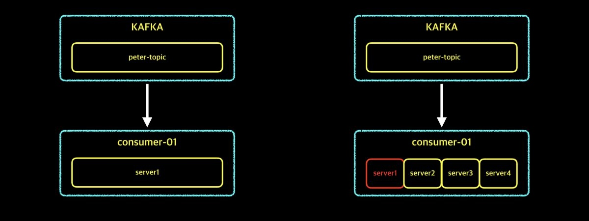

# apache Kafka 

## 컨슈머에 대하여

카프카의 컨슈머는 다른 메시징 시스템과 다소 다르다. 다른 메시징 시스템에서는 컨슈머가 데이터를 가져가면 데이터가 사라지지만 카프카는 그렇지 않다.

이와 같은 특징 덕분에 카프카는 데이터 파이프라인으로 운영하는데 매우 핵심적인 역할을 하게 된다.

 

컨슈머는 다음과 같은 역할을 한다.

- 토픽의 파티션으로부터 데이터 폴링
- 파티션 오프셋 위치 기록(commit)
- 컨슈머 그룹을 통해 병렬 처리

### 

### 실습

다음 시간에~

### 데이터 폴링

*컨슈머 핵심 로직*

컨슈머는 폴링 루프(폴 메서드가 포함된 무한 루프)를 통해서 브로커로부터 연속적으로 그리고 컨슈머가 허락하는한 데이터를 가져오게 된다.

해당 코드에서는 `println`으로 찍어보기만 했지만, 실제 기업에서는 하둡, 엘라스틱 서치 같은 저장소에 저장하는 로직을 넣기도 한다.

### 동작 원리

*프로듀서가 토픽에 넣은 메시지들*

프로듀서가 라운드 로빈으로 위와 같이 데이터를 넣었다고 가정하자.

*오프셋 형태*

오프셋은 토픽별로 파티션별로 별개로 지정된다. 오프셋은 컨슈머가 데이터를 어느 지점까지 읽었는지 확인하는 용도로 사용된다. 

*컨슈머의 폴링에 따른 오프셋 정보*

컨슈머가 읽기 시작하면 `__consumer_offsets` 토픽에 오프셋 정보를 저장하게 된다.

> ⚠️ 오프셋의 기준
>
> 오프셋은 컨슈머 기준이 아닌, 컨슈머 그룹별로 매겨진다고 한다. 이는 실습을 해보면서 확인하면 좋겠다.

*컨슈머의 고가용성*

혹시 컨슈머가 장애가 생겨도  `__consumer_offsets` 토픽에 오프셋 정보가 저장되어 있기 때문에 시작 위치를 복구할 수 있다. 이를 통해 고가용성을 이룰 수 있게 된다. 

### 멀티 컨슈머

*멀티 컨슈머*

컨슈머의 개수에 따라 데이터를 어떻게 가져갈까?

- 컨슈머 1개
  - 파티션 0과 1에서 데이터를 가져간다. 
- 컨슈머 2개
  -  각각의 파티션에서 데이터를 가져간다. 
- 컨슈머 3개
  -  이미 파티션들이 각 컨슈머에 할당 되었기 때문에 더 이상 할당될 파티션이 없어서 동작하지 않는다. 

> ❓ 컨슈머가 더 많아도 병렬처리 되지 않나?
>
> 병렬처리된다고 볼 수 있지만, 나머지 할당되지 않은 컨슈머의 리소스가 낭비된다. 가장 효율적인 병렬처리 사이즈는 파티션 수 = 컨슈머 수이다. 이에 대한 내용은 [링크](https://www.popit.kr/kafka-consumer-group/) 참조
>
> 

### 멀티 컨슈머 그룹

*멀티 컨슈머 그룹*

컨슈머 그룹별로 토픽별로 오프셋을 나누어 저장하기 때문에 엘라스틱 서치에 저장하는 컨슈머 그룹이 데이터를 읽고 있어도 하둡에 저장하는 컨슈머 그룹에 영향을 미치지 않는다.

이러한 특징을 토대로 하나의 데이터가 여러 서비스에서 처리될 수 있다.

#### 컨슈머 그룹이 필요한 이유

*하나의 컨슈머와 여러 개의 컨슈머를 가진 컨슈머 그룹의 장애 안정성*

1. 하나의 컨슈머 대신 컨슈머 그룹에 여러 컨슈머를 넣음으로서 단일 컨슈머 장애에 대해 안정성을 확보할 수 있다.

2. 컨슈머 그룹별로 오프셋이 지정되기 때문이다. 컨슈머로만 이루어진다면 폴링한 데이터의 순서가 정합하지 않게 된다.

## 출처

- [데브원영 유튜브](https://youtu.be/rBVCvv9skT4)

