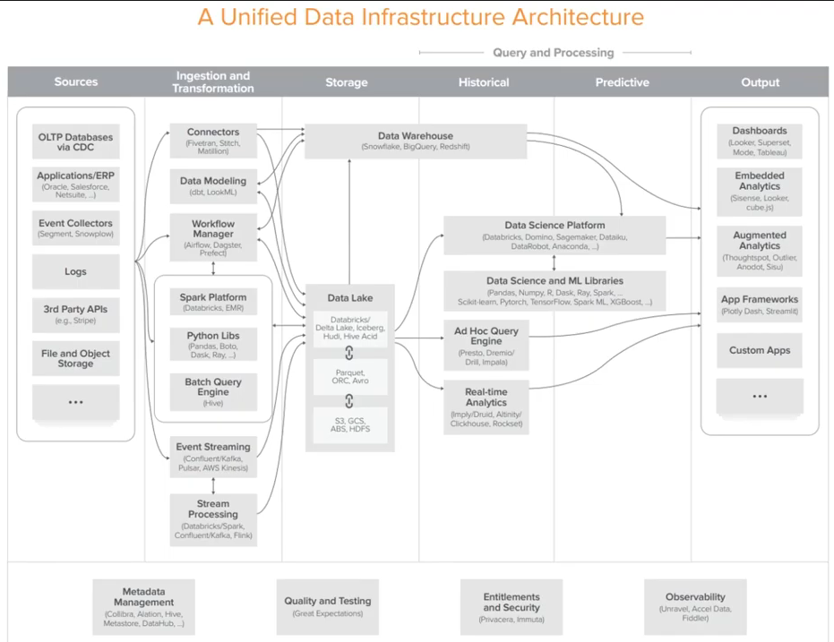

# 기본 개념과 단어 설명(데이터 인프라의 목적, 데이터 웨어하우스, ETL 과 ELT, 데이터 엔지니어 vs 어낼리스트 vs 사이언티스트)

데이터 기반의 의사 결정을 하고 데이터가 흐르는 제품과 조직이 되려면 데이터 인프라를 구축해야 한다.

## 데이터 인프라의 목적

- 비즈니스 리더들의 의사결정을 도와주기
- 서비스/제품을 데이터의 도움을 받아 향상시키기

## 프로덕션 vs 데이터 웨어하우스

- Production System
    - 회사내의 데이터가 만들어지는 곳. 실제 서비스 운영에 사용되는 데이터.
    - 제품이 각각 다르기 때문에 각 제품에 맞게 분석 도구를 사용해야하는 불편함이 있다.
    - Normalized Schema (many small tables)
        - 대부분의 데이터들이 정규화되어 있다.
- Data Warehouse
    - 통합된 분석 보고서 작성을 위해 다양한 **소스**로부터 데이터를 저장.
    - Dimensional Schema (fewer, simpler tables)
        - 더 쉬운 형태로 원하는 데이터만 뽑을 수 있도록 만들어져 있다.

## ETL(Extract, Transform, Load)

- 추출 (**Extract** data from production)
- 변환 (**Transform** normalized to dimensional schema)
- 적재 (**Load** into Data Warehouse)

추출과 변환이 자동화될 수 없고 회사마다 다르다는 불편함이 있다. 그래서 요즘에는 추출 -> 적재 -> 변환을 하는 ELT로 바뀌고 있다.

## 데이터 엔지니어 vs 어낼리스트 vs 사이언티스트

- 데이터 엔지니어
    - 빅데이터를 처리할 수 있는 인프라 & 아키텍처를 만드는 사람
    - 요구기술: 프로그래밍, 수학, 빅데이터 다양한 데이터베이스 지식, ETL 및 BI 도구들에 대한 지식
    - 주 사용 언어: Python, SQL, 쉘스크립트
- 데이터 분석가
    - 데이터를 해석해서 비즈니스 의사결정을 돕는 정보로 만드는 사람
    - 요구기술: 통계학, 수학, 커뮤니케이션, 스프레드시트 & DB 사용, BI 도구를 이용한 시각화
    - 주 사용 언어: SQL, R, Python 약간
- 데이터 과학자
    - 수학자 + 과학자 + 도메인전문가. 큰 데이터도 잘 다루고, 복잡한 문제를 해결하는 사람
    - 수학, 통계학, ML, 딥러닝, 분산 컴퓨팅, 데이터 모델링, 스토리텔링, 시각화, 도메인 지식, 커뮤니케이션
    - 주 사용 언어: SQL, R, Python

## Sources, Ingestion and Transformation, Storage, Query and Processing, Output

- Sources: 회사 내의 모든 데이터가 만들어지는 곳. (= Data Source)
- Ingestion and Transformation: 가져와서 변환
- Storage: Data Warehouse, Data Lake
- Historical: 적재된 이전의 데이터로 분석
- Predictive: 적재된 이전의 데이터로 미래를 예측
- Output: 결과를 보여준다.
