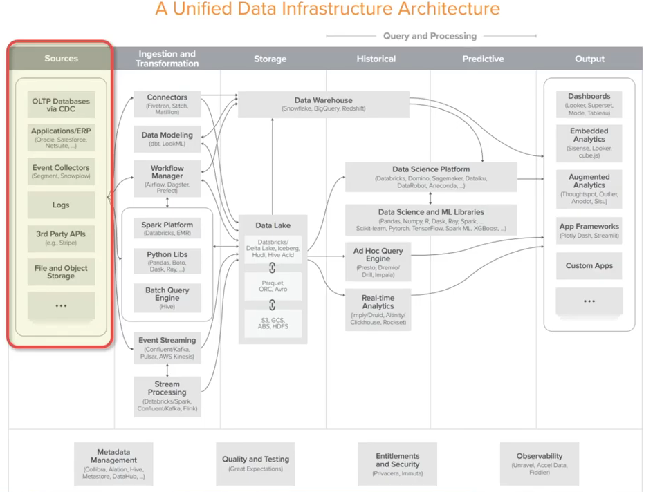
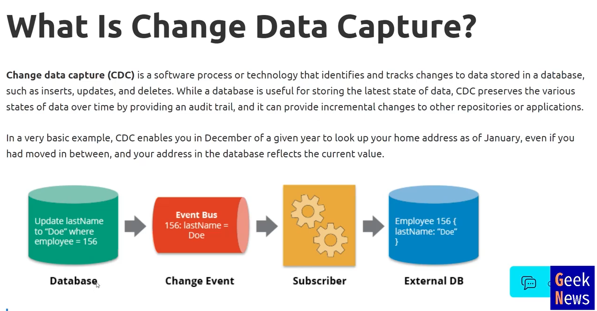

# 데이터 소스(OLTP, CDC, ERP, CRM, Event Collector, Segment, Snowplow, Rudderstack)

## OLTP vs OLAP

- OLTP
    - Transactional App
    - High volume of transactions
    - Fast processing
    - Normalized data
    - Many tables
- OLAP
    - Analytics, Reporting
    - High volume of data
    - Slow queries
    - Denormalized data
    - Fewer tables

## CDC: Change Data Capture

OLTP에서 일어나는 대부분의 행동들은 데이터가 변경되는 것이다. CDC는 변경되는 데이터를 가져다가 외부 DB로 복사한다.
OLTP DB는 트랜잭션을 기록하는 데에만 집중되어 있고, 그 트랜잭션 데이터를 다른 곳이 쓰지 못한다. OLTP 데이터를 가져다가 변경된 부분만 다른 DB에 복사하는 것이 CDC이고 이것을 통해서 OLTP에서 변경된 것을 분석 DB로 보내 처리하는 것이다.

## Applications/ERP (Oracle ERP, Salesforce CRM, Netsuite ERP)
회사, 고객과 관련된 모든 데이터를 관리하는 도구 = 회사 내부의 데이터

## Event Collector
Applications/ERP가 비즈니스 사이드에서 발생하는 데이터라면 Event Collector는 사용자가 만들어내는 모든 데이터를 모으는 도구를 말한다. = 사용자의 데이터
- Segment
    - Customer Data Platform이다.
    - 여러 Event Collector의 제품들을 통합해서 관리할 수 있도록한다.
- Snowplow
    - Segment와 비슷한 오픈소스이다.
- Rudderstack
    - 오픈소스이다. Snowplow 보다 조금 더 유용한 기능들이 많다.

## Logs
운영하는 서버들의 모든 로그

## 3rd Party APIs
- Stripe
  - Payments Infra

## File and Object Storage
- 문서 혹은 다양한 객체 스토리지. 애플리케이션들이 저장하는 파일과 같은 것들.
