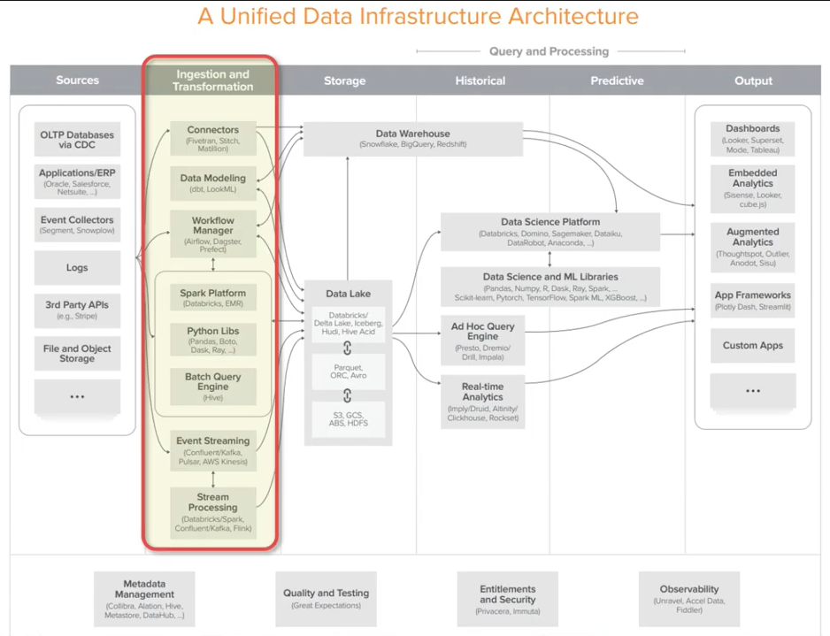
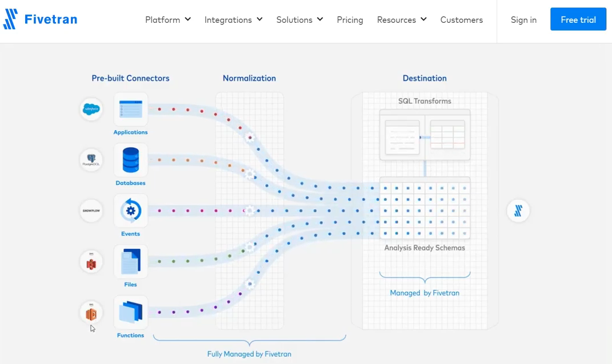
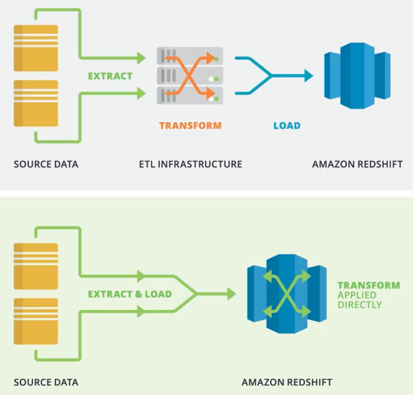

# ETL/ELT 도구들(Fivetran, Stitch, Matillion, Panoply)

## Connectors

Source에서 발생한 데이터를 연결해서 Data Warehouse 또는 Data Lake로 전달한다.

- Fivetran
  

ETL에서 ELT로 넘어가면 저장공간을 더 효율적으로 쓸 수 있다. 저장된 것을 바탕으로 자유로운 Transform이 가능하기 때문이다.

