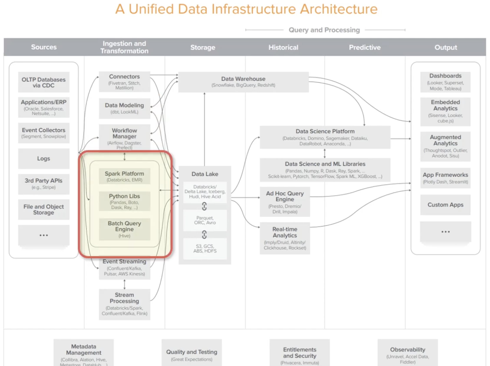

# Spark, Python, Hive

## Python lib

- pandas
    - fast, powerful, flexible open source data analysis and manipulation tool
- DASK
    - python에서 병렬처리가 가능하도록 도와주는 tool

## Spark

Spark는 대규모 데이터 처리를 위한 통합 분석 엔진이다. (open-source distributed general-purpose cluster-computing framework)

Spark를 이용해서 빅데이터를 분산 처리하고, 이 처리(task)를 실행하기 위한 도구로 Workflow Manager가 사용된다.

- Hadoop과의 차이점
    - 현재는 거의 main으로 Spark를 사용한다.
    - Spark가 Hadoop의 Map-Reduce 보다 100배 빠르다고 한다.
        - 데이터를 memory에서 캐싱해서 사용하기 때문에 빠르다.
    - Batch 목적으로 사용하는 Hadoop에 비해 범용적으로 사용 가능하다.

[Spark의 핵심은 무엇일까?](https://www.slideshare.net/yongho/rdd-paper-review?qid=5a6f74b5-710e-4292-ab4f-67772fa44bf6&v=&b=&from_search=1)
자료를 참고하자.

## Hive

Hadop(HDFS)위에 올라와있는 데이터를 쿼리하기 위한 엔진이다. SQL을 작성하면 SQL job이 MapReduce job으로 변환되어 처리된다.
